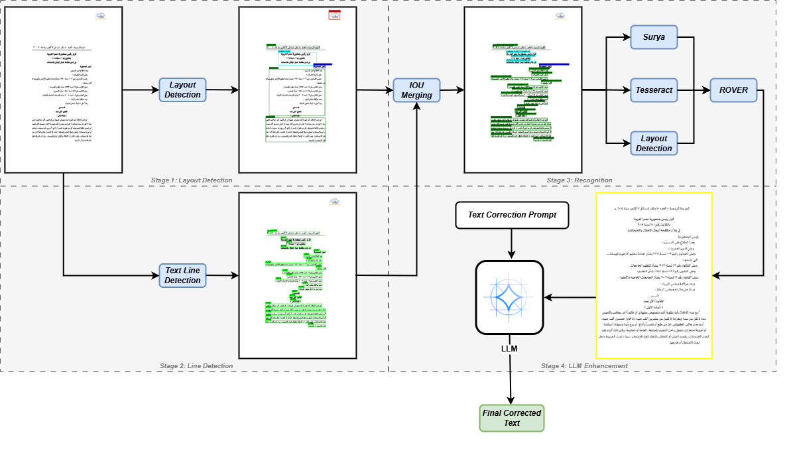

# EvenBetterOCR: Advanced OCR Pipeline

[](https://www.python.org/downloads/)
[](https://opensource.org/licenses/MIT) <!-- 

**EvenBetterOCR** is a powerful and flexible Optical Character Recognition (OCR) pipeline that improves on [BetterOCR][https://github.com/junhoyeo/BetterOCR] , designed to deliver high-accuracy text extraction from documents (PDFs and images). It leverages a multi-stage process involving state-of-the-art OCR engines, advanced line-merging techniques, and Large Language Model (LLM) based refinement.

The core idea is to overcome the limitations of individual OCR engines by:
1.  Utilizing a dedicated engine for robust layout detection and text line segmentation.
2.  Employing multiple OCR engines in parallel for text recognition on these detected lines.
3.  Intelligently merging the outputs of different recognizer engines at the line level.
4.  Optionally refining the merged text using powerful LLMs, especially for lower-confidence outputs.

## ✨ Features

*   **Hybrid OCR Approach:**
    *   **Dedicated Detection Engine:** Uses a specialized engine (e.g., Surya) for accurate document layout analysis and text line detection.
    *   **Parallel Recognition Engines:** Supports multiple OCR engines (e.g., Surya, Tesseract) for recognizing text within the detected lines.
*   **Advanced Line Merging:** Implements a sophisticated `LineROVERMerger` to combine outputs from two recognizer engines, leveraging token alignment, confidence scores, and dictionary checks (using `wordfreq` and `camel-tools` for Arabic).
*   **LLM-Powered Refinement:** Integrates with LLMs (Gemini, Groq via `langchain-groq`) to correct and enhance OCR results, particularly for pages with lower confidence scores.
*   **Flexible Engine Configuration:**
    *   Easily select detector and recognizer engines.
    *   Provide engine-specific configurations via JSON.
*   **Document Format Support:** Processes both PDF and common image formats (PNG, JPG, JPEG, BMP, TIFF).
*   **API & CLI Access:**
    *   **Flask API:** Provides an HTTP endpoint (`/ocr`) for easy integration into other services.
    *   **Command-Line Interface:** Offers a comprehensive CLI (`src/main.py`) for direct processing and experimentation.
*   **Language Support:** Configurable language support, with a focus on Arabic ('ar') demonstrated in configurations.
*   **Evaluation Framework:** Includes an `eval.py` script to benchmark different OCR engines (including EvenBetterOCR itself) against ground truth data using CER and Levenshtein distance.
*   **Modular Design:**
    *   Pluggable `IEngine` interface for adding new OCR engines.
    *   Separate components for parsing, combining, LLM processing, and engine management.
*   **Visualization:** Options to display bounding boxes, layout regions, and annotated outputs for debugging and analysis (CLI only).

## 🏛️ Architecture Overview

The EvenBetterOCR pipeline generally follows these steps :

1.  **Document Parsing:**
    *   Input document (PDF/image) is loaded.
    *   PDFs are converted into a series of page images using `PyMuPDF` (with `pdf2image` as a fallback).

2.  **Layout & Line Detection (Detector Engine):**
    *   A designated "detector" engine (e.g., Surya) processes each page image.
    *   It identifies layout regions (text blocks, headers, etc.) and segments them into individual text lines.
    *   The output is a structured list of detected line bounding boxes for each page, often with layout context.

3.  **Parallel Text Recognition (Recognizer Engines):**
    *   One or more "recognizer" engines (e.g., Surya, Tesseract) are run in parallel.
    *   Each recognizer processes the detected text lines (from step 2) on each page image to extract text and confidence scores.

4.  **Line-Level Merging (LineROVERMerger):**
    *   If enabled and two recognizer outputs are available, their results are merged line by line.
    *   `LineROVERMerger` aligns tokens from the two engine outputs for each corresponding line.
    *   It uses a voting-like scheme based on token text, confidence scores, and dictionary lookups (especially for Arabic using `camel-tools` and `wordfreq`) to produce a consensus text for each line.

5.  **LLM Refinement (Optional):**
    *   If enabled, the processed text for each page is evaluated.
    *   If a page's average confidence (from merging or primary recognizer) is below a configurable threshold, the text is sent to an LLM (Gemini or a Groq-hosted model).
    *   The LLM is prompted to correct errors, improve readability, and ensure consistency based on the provided OCR text and optional context keywords.

6.  **Output Generation:**
    *   The final processed text, potentially refined by the LLM, is returned.
    *   The CLI can save this to a file, while the API returns it in a JSON response.



## 📂 Project Structure

```
adham137-evenbetterocr/
├── app.py                      # Flask API endpoint
├── eval.py                     # Evaluation script for OCR engines
├── src/
│   ├── main.py                 # Main CLI application & core processing orchestrator
│   ├── combiner/
│   │   ├── combiner.py         # OCRCombiner: Manages detection, recognition, merging
│   │   └── lineMerger.py       # LineROVERMerger: Advanced line-level merging logic
│   ├── engines/
│   │   ├── EngineRegistry.py   # Registers available OCR engine classes
│   │   ├── IEngine.py          # Abstract base class for OCR engines
│   │   └── concrete_implementations/
│   │       ├── easyOCR.py      # EasyOCR engine (currently commented out in main.py)
│   │       ├── suryaOCR.py     # Surya OCR engine (can act as detector and/or recognizer)
│   │       └── tesseractOCR.py # Tesseract OCR engine (recognizer)
│   ├── llm/
│   │   ├── llm_processor.py    # LLMProcessor: Handles prompt generation and LLM calls
│   │   ├── prompts.py          # Stores prompt templates for LLM
│   │   └── clients/
│   │       ├── gemini_client.py # Client for Google Gemini API
│   │       └── groq_client.py   # Client for Groq API (via Langchain)
│   └── parsers/
│       └── parser.py           # DocumentParser: Loads and converts documents to images
├── requirements.txt            # Python dependencies (should be generated)
└── README.md                   # This file
```

## 🛠️ Installation

1.  **Clone the repository:**
    ```bash
    git clone https://github.com/adham137/evenbetterocr.git # Replace with actual URL if different
    cd adham137-evenbetterocr
    ```

2.  **Create a Python virtual environment (recommended):**
    ```bash
    python -m venv venv
    source venv/bin/activate  # On Windows: venv\Scripts\activate
    ```

3.  **Install Tesseract OCR:**
    Tesseract is required by `tesseractOCR.py`. Follow the installation instructions for your OS:
    *   **Windows:** Download installer from [UB Mannheim Tesseract releases](https://github.com/UB-Mannheim/tesseract/wiki). Ensure Tesseract is added to your PATH.
    *   **Linux (Ubuntu/Debian):**
        ```bash
        sudo apt update
        sudo apt install tesseract-ocr
        sudo apt install libtesseract-dev
        ```
    *   **macOS:**
        ```bash
        brew install tesseract
        ```
    Install language packs as needed (e.g., `tesseract-ocr-ara` for Arabic, `tesseract-ocr-eng` for English).

4.  **Install Python dependencies:**
    A `requirements.txt` file should be present or generated. Key dependencies include:
    `Flask`, `Pillow`, `pytesseract`, `surya-ocr`, `torch`, `torchvision`, `torchaudio`, `jiwer`, `camel-tools`, `wordfreq`, `edlib`, `langchain-groq`, `google-generativeai` (for Gemini client, though `requests` is used directly in `gemini_client.py`), `PyMuPDF`.
    ```bash
    pip install -r requirements.txt
    ```
    *Note: `surya-ocr` and `torch` can be large. Ensure you have sufficient disk space and consider PyTorch installation options for CUDA if you have a compatible NVIDIA GPU (see [PyTorch website](https://pytorch.org/get-started/locally/)).*

5.  **Set up Environment Variables:**
    Create a `.env` file in the project root or set environment variables directly for LLM API keys:
    ```
    GROQ_API_KEY="your_groq_api_key"
    GEMINI_API_KEY="your_gemini_api_key"
    ```
    The application will load these if `python-dotenv` is used or if they are set in your shell. `app.py` and `src/main.py` attempt to read these from `os.environ`.

## 🚀 Usage

### Command-Line Interface (CLI)

The main entry point for CLI usage is `src/main.py`.

**Basic Usage:**
```bash
python src/main.py /path/to/your/document.pdf
```

**Common Options:**

*   `document_path`: (Required) Path to the PDF or image file.
*   `--ocr_engines`: Space-separated list of recognizer engines.
    *   Choices: `suryaocr`, `tesseractocr`. (EasyOCR might be available if re-enabled).
    *   Default: `suryaocr tesseractocr`
*   `--detector_engine`: Engine for layout/line detection.
    *   Choices: `suryaocr`, `tesseractocr`.
    *   Default: `suryaocr`
*   `--lang`: Space-separated list of language codes (e.g., `ar en`). Default: `ar`.
*   `--use_line_merging`: Enable/disable line merging (default: enabled). If enabled, uses the first two engines from `--ocr_engines`.
*   `--line_merger_config_json`: JSON string for `LineROVERMerger` configuration (e.g., `{"min_wordfreq_for_dict_check": 1e-7}`).
*   `--use_llm`: Enable/disable LLM refinement (default: enabled).
*   `--llm_refinement_threshold`: Confidence threshold below which LLM is triggered (e.g., `0.80`).
*   `--llm_model_name`: LLM model to use (e.g., `gemma2-9b-it` for Groq, or relevant Gemini model name).
*   `--groq_api_key` / `--gemini_api_key`: API keys (can also be set via env vars).
*   `--output_file`: Path to save the final text output.
*   `-v` / `-vv`: Verbosity level (INFO/DEBUG).
*   Display options for debugging (e.g., `--display_layout_regions`, `--display_detected_lines`).

**Example (Advanced):**
```bash
python src/main.py "my_document.pdf" \
    --detector_engine suryaocr \
    --ocr_engines suryaocr tesseractocr \
    --lang ar \
    --use_line_merging \
    --use_llm \
    --llm_model_name "gemma2-9b-it" \
    --llm_refinement_threshold 0.75 \
    --output_file "output.txt" \
    -v
```

### Flask API

The `app.py` script runs a Flask server providing an OCR endpoint.

**Run the API server:**
```bash
python app.py
```
The server will typically start on `http://0.0.0.0:5000`.

**Endpoint:** `/ocr`
**Method:** `POST`
**Request Type:** `multipart/form-data`

**Form Fields:**

*   `document_file`: The PDF or image file to process. (Required)
*   `detector_engine`: (Optional) Name of the detector engine (e.g., `suryaocr`). Default: `suryaocr`.
*   `ocr_engines`: (Optional) Comma-separated list of recognizer engine names (e.g., `suryaocr,tesseractocr`). Default: all available.
*   `lang`: (Optional) Comma-separated list of language codes (e.g., `ar,en`). Default: `ar`.
*   `engine_configs_json`: (Optional) JSON string for engine-specific configurations. Default: `{}`.
*   `use_line_merging`: (Optional) `true` or `false`. Default: `true`.
*   `line_merger_config_json`: (Optional) JSON string for `LineROVERMerger` config. Default: `{}`.
*   `use_llm`: (Optional) `true` or `false`. Default: `true`.
*   `llm_refinement_threshold`: (Optional) Float value (e.g., `0.80`). Default: `0.80`.
*   `llm_model_name`: (Optional) LLM model name. Default: `gemma2-9b-it`.
*   `groq_api_key`: (Optional) Groq API key.
    *Note: `gemini_api_key` is not explicitly taken as a form field in `app.py` for Gemini, it relies on environment variable.*
*   `llm_context_keywords`: (Optional) String of context keywords for LLM.
*   `llm_temp`: (Optional) Float for LLM temperature. Default: `0.0`.
*   `verbose`: (Optional) Integer for server-side logging verbosity (`0`, `1`, `2`). Default: `0`.

**Example `curl` Request:**
```bash
curl -X POST -F "document_file=@/path/to/your/document.pdf" \
     -F "detector_engine=suryaocr" \
     -F "ocr_engines=suryaocr,tesseractocr" \
     -F "lang=ar" \
     -F "use_llm=true" \
     -F "llm_model_name=gemma2-9b-it" \
     http://localhost:5000/ocr
```

**Success Response (200 OK):**
```json
{
  "status": "success",
  "processed_text": "The extracted and refined text from the document...\nPage 2 text...\n..."
}
```

**Error Response (e.g., 400, 500):**
```json
{
  "error": "Error message describing the issue."
}
```

## ⚙️ Configuration Details

*   **Engine Configurations (`engine_configs_json`):**
    Allows passing specific parameters to individual OCR engines during their initialization. The JSON string should be a dictionary where keys are engine names (e.g., `suryaocr`, `tesseractocr`) and values are dictionaries of parameters.
    Example: `{"suryaocr": {"page_processing_batch_size": 2}, "tesseractocr": {"tesseract_single_line_config": "--psm 8"}}`

*   **Line Merger Configuration (`line_merger_config_json`):**
    Parameters for the `LineROVERMerger` class.
    Example: `{"min_wordfreq_for_dict_check": 1e-8, "insertion_confidence_threshold": 0.5, "vocab_override_confidence": 0.95}`
    Refer to `src/combiner/lineMerger.py` for available parameters.

## 📊 Evaluation (`eval.py`)

The `eval.py` script provides a framework to evaluate the performance of different OCR configurations (including the full EvenBetterOCR pipeline and individual engines like Tesseract, Surya, EasyOCR) against a dataset of PDFs and their corresponding ground truth text files.

**Setup:**
1.  Prepare a directory with your test PDF files (e.g., `dataset/pdfs/`).
2.  Prepare a directory with ground truth `.txt` files. The script expects ground truth filenames to match the PDF filenames with `_modified.txt` appended (e.g., if PDF is `doc1.pdf`, GT is `doc1_modified.txt`).
3.  Update `PDF_PATH` and `GT_PATH` variables in `eval.py` to point to your directories.

**Run Evaluation:**
```bash
python eval.py
```
Results, including per-file CER (Character Error Rate) and Levenshtein distance, along with aggregate statistics, will be saved to a JSON file (default: `data/ocr_bench.json`).

The script internally defines configurations for:
*   Standalone Surya, EasyOCR, Tesseract.
*   EvenBetterOCR (with specific settings for detection, recognition, merging, and LLM).

You can modify these configurations within `eval.py` to test different setups.

## 🧩 Extending EvenBetterOCR

### Adding a New OCR Engine

1.  Create a new Python file in `src/engines/concrete_implementations/` (e.g., `myNewOCREngine.py`).
2.  Implement a class that inherits from `src.engines.IEngine.OCREngine`.
3.  Implement all abstract methods defined in `IEngine`:
    *   `__init__(self, lang_list: List[str], **kwargs)`
    *   `recognize_text(self, images: List[Image.Image]) -> List[str]`
    *   `get_structured_output(self, images: List[Image.Image]) -> List[List[Dict[str, Any]]]`
    *   `display_bounding_boxes(...)`
    *   `display_annotated_output(...)`
    *   Additionally, for engines to be used in the new pipeline (detector/recognizer roles):
        *   If it's a detector: Implement a method like `detect_text_lines_with_layout(...)` (see `SuryaOCREngine`).
        *   If it's a recognizer: Implement a method like `recognize_detected_lines(...)` (see `TesseractOCREngine`).
4.  Import and add your new engine class to the `AVAILABLE_ENGINES` dictionary in `src/main.py`.
    ```python
    # In src/main.py
    from .engines.concrete_implementations.myNewOCREngine import MyNewOCREngine
    # ...
    AVAILABLE_ENGINES = {
        # ... existing engines ...
        "mynewocr": MyNewOCREngine,
    }
    ```
5.  Your new engine will then be available for selection via CLI (`--ocr_engines`, `--detector_engine`) and API.

### Adding a New LLM Client

1.  Create a new Python file in `src/llm/clients/` (e.g., `myNewLLMClient.py`).
2.  Implement a class with a `run(self, prompt: str, **kwargs) -> str` method that takes a prompt and returns the LLM's response as a string.
3.  Modify `src/main.py` and `app.py` in the LLM processing section to allow selection or instantiation of your new client. This might involve adding new configuration options or logic to choose the client.

## 🤝 Contributing

Contributions are welcome! Please follow these general guidelines:

1.  **Fork the repository.**
2.  **Create a new branch** for your feature or bug fix: `git checkout -b feature/your-feature-name` or `git checkout -b fix/your-bug-fix`.
3.  **Make your changes.** Ensure code is well-commented and follows existing style.
4.  **Add tests** for any new functionality.
5.  **Ensure all tests pass.**
6.  **Lint your code** (e.g., using Flake8, Black).
7.  **Submit a pull request** with a clear description of your changes.


## 🙏 Acknowledgements

*   The developers of Tesseract OCR, Surya OCR, EasyOCR and BetterOCR.
*   The creators of PyMuPDF, Pillow, Flask.
*   Langchain, Groq, and Google Gemini for their LLM services.
*   Libraries like `jiwer`, `camel-tools`, `wordfreq`, `edlib`.
```
